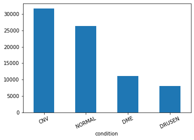

# Samsung OCT Project

## Table Of Contents
- [Intro](#intro)
- [The Datasets](#the-datasets)
- [The process](#the-process)
- [Data Wrangling](#data-wrangling)
  - [data_wrangling_from_kaggle_dataset.ipynb](#data_wrangling_from_kaggle_datasetipynb)
  - [data_wrangling_from_mendeley.ipynb]()
  - [data_wrangling_comparison.ipynb]()
  - [Data Wrangling conclusions](#data-wrangling-conclusions)

## Intro

This project was done by:
- Felipe Caballero (https://github.com/caballerofelipe/)
- Gabriel Santos Elizondo (https://github.com/Gsantos4)
- George Prounis (https://github.com/prounis)

It was the Capstone Project for the Machine Learning Engineer course by [FourthBrain.ai](https://www.fourthbrain.ai/).

Check out the [Report](./report.pdf) and the [Presentation](./presentation.pdf).

## The Datasets
- Mendeley (The one used during the project)
  - [Version 2 of the project](https://data.mendeley.com/datasets/rscbjbr9sj/2).
  - [Version 3 of the project](https://data.mendeley.com/datasets/rscbjbr9sj/3).
  - [Direct download](https://data.mendeley.com/public-files/datasets/rscbjbr9sj/files/5699a1d8-d1b6-45db-bb92-b61051445347/file_downloaded).
- Kaggle
  - [Kaggle Dataset](https://www.kaggle.com/paultimothymooney/kermany2018/).
  - [Direct download](https://www.kaggle.com/paultimothymooney/kermany2018/download) if registered in Kaggle.

## The process
The project was done in these steps:
- Data Wrangling
- Baseline experiments
- Transfer Learning after training the model on COVID Dataset ([*COVID-CTset: A Large COVID-19 CT Scans dataset*](https://www.kaggle.com/mohammadrahimzadeh/covidctset-a-large-covid19-ct-scans-dataset)).
- Semi supervised learning using only 5% of labeled data.

## Data Wrangling
The proposed project pointed to [this Kaggle Dataset](https://www.kaggle.com/paultimothymooney/kermany2018/). But this data advertised a 5.81GB dataset and when downloaded it was more than 10GB. So we decided to review the files. There are three notebooks that do this.

### data_wrangling_from_kaggle_dataset.ipynb
[`data_wrangling/kaggle/data_wrangling_from_kaggle_dataset.ipynb`](./data_wrangling/kaggle/data_wrangling_from_kaggle_dataset.ipynb)

In this notebook we created a Pandas DataFrame to store all the information about the files in the [Kaggle Dataset](https://www.kaggle.com/paultimothymooney/kermany2018/), incluiding their md5 hash, this was done for comparison purpuses.

The result for this notebook is a CSV file included with it.

### data_wrangling_from_mendeley.ipynb
[`data_wrangling/mendeley/data_wrangling_from_mendeley.ipynb`](./data_wrangling/mendeley/data_wrangling_from_mendeley.ipynb)

In this notebook we created a Pandas DataFrame to store all the information about the files in the [Mendeley Dataset](https://data.mendeley.com/datasets/rscbjbr9sj/2), incluiding their md5 hash, this was done for comparison purpuses.

The results for this notebook are two CSV file included with it:
- The first CSV (`mendeley_filelist.csv`) contains information on all files.
- The second CSV (`mendeley_filelist_combo_cond_md5.csv`) removing duplicates (duplicates are considered when two or more files have the same condition and md5).

### data_wrangling_comparison.ipynb
[`data_wrangling/data_wrangling_comparison.ipynb`](./data_wrangling/data_wrangling_comparison.ipynb)

The objective of this notebook was to compare both datasets to see if they had the same unduplicated notebooks.

Both datasets contained the same unduplicated files. Se from this point on we used the Mendeley one.

### Data Wrangling conclusions
We use the [Mendeley Dataset](https://data.mendeley.com/public-files/datasets/rscbjbr9sj/files/5699a1d8-d1b6-45db-bb92-b61051445347/file_downloaded).

<figure align="center"><figcaption align = "center">Dataset class (conditions) distribution</figcaption></figure>

We consider duplicates when two or more files have the same condition and md5.

The Mendeley dataset we used (as the Kaggle one) contains a total of 84,484 files, of which 7,357 are duplicates. We ended with 77,127 usable files. We used a Pandas DataFrame to store these files’ information and to do further work.

## To be reviewed
### Implementation details
#### The Notebooks
- `v1 OCT TensorFlow Resnet 50 Model.ipynb`  
First attempt to train a Resnet50 for classification of the different conditions. Using TensorFlow's default parameters.
- `v2 OCT TensorFlow Resnet 50 Model.ipynb`  
Second attempt to train a Resnet50 for classification of the different conditions. Using tested parameters and earning Rate reduction on plateau.
- GEORGE'S NOTEBOOK WELL FORMATTED  
Transfer learning experiment, a Resnet50 trained on an OCT dataset and then used that model as transfer learning for a reduced OCT dataset.
- GABRIEL'S NOTEBOOK WELL FORMATTED  
Notebook to define hyperparameters for the classification problem of the OCT dataset.
- `v2_reduced OCT TensorFlow Resnet 50 Model.ipynb`  
Some later experiments use a reduced training dataset, this serves as a baseline for those experiments.
